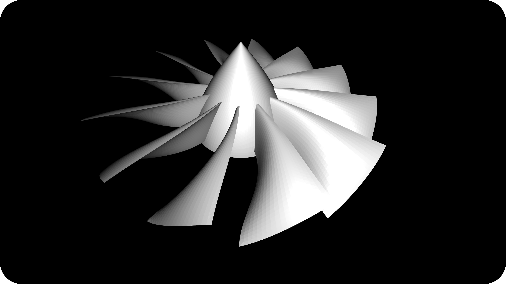
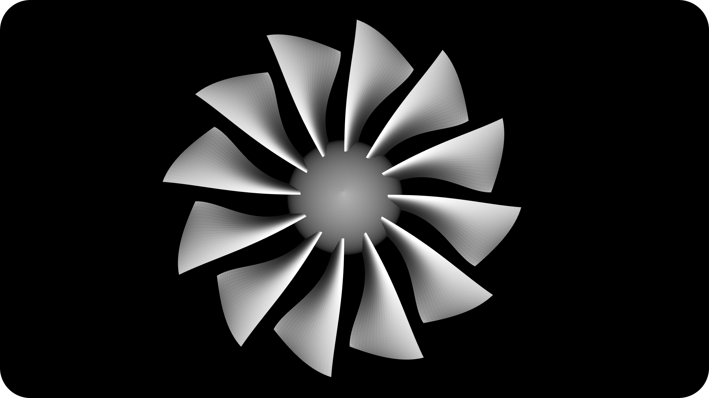

# Turbine Fan Generator
A flexible turbine fan generator using multiple curves for control, written in Javascript. The turbine generator has no dependecies, however for viewing purposes I use THREE JS. 
I created this project because I wanted to use it to generate fan blades for my drone, in any size, with any amount of fanblades, many more settings can be tweaked.

Various things that can be done are...
* You can dynamically change the size of the blades, the cut-off point relative to the propellor shroud & the amount of fan blades. 
* Change the curvature of the fanblades, fanblade shroud. You can also quite easily change the tickness of the blades while manipulating the curves. 
* The final result can be easily exported to an STL file, to do this you need to press the p key.

# Pictures

  
  &nbsp; &nbsp; &nbsp; &nbsp;
  

# License
This project uses the MIT Attribution license.
